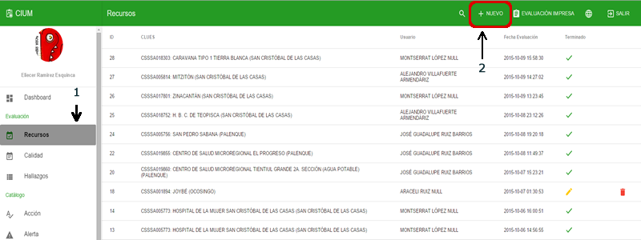
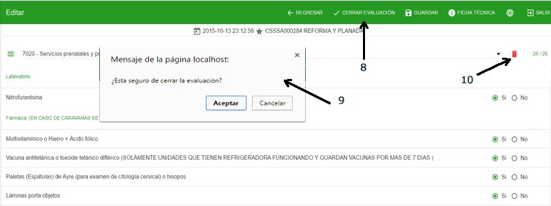
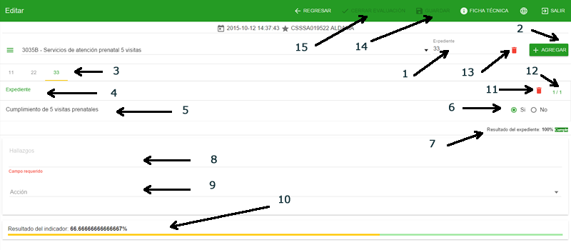
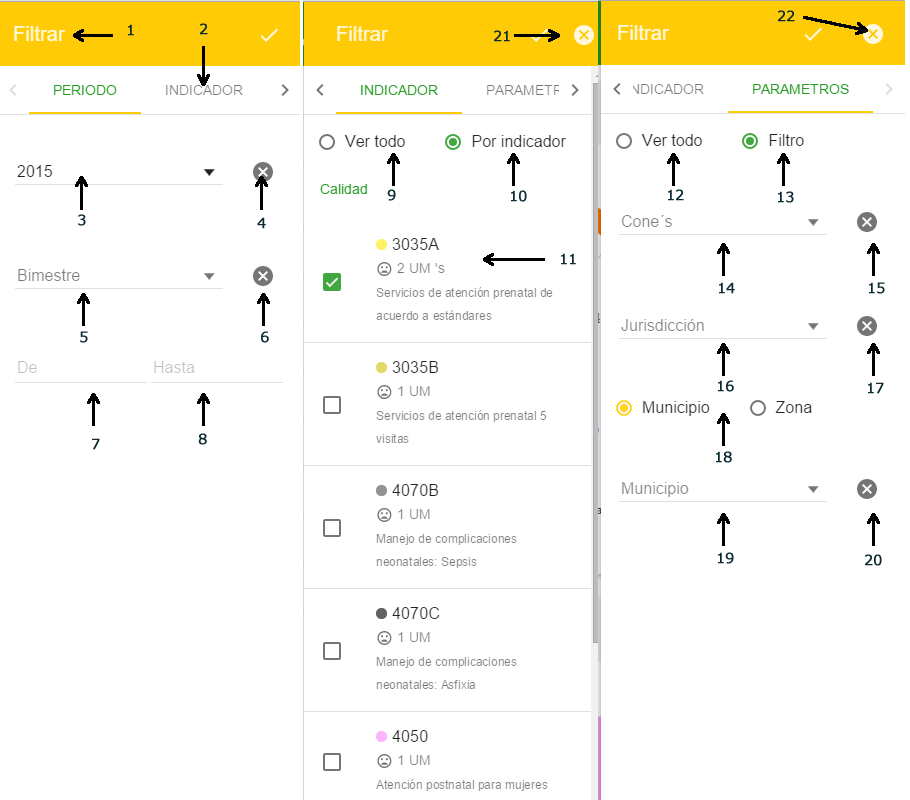
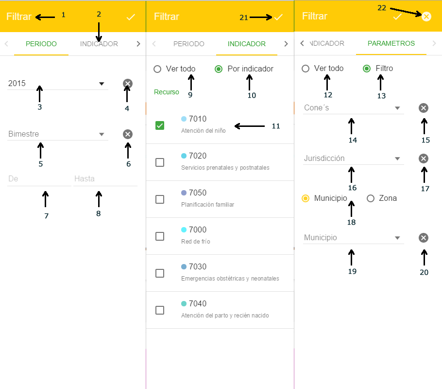
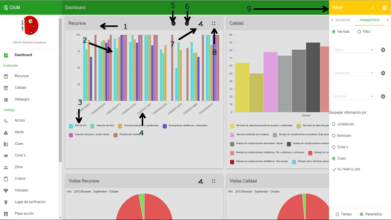

# Evaluaciones

En este apartado se encuentra las parte transaccional de la aplicación es decir la parte donde se generan y procesan los datos recabados de las evaluaciónes.
 
 
Las evaluaciónes de recursos y calidad tiene un listado con el formato y las opciones siguientes:

>**Listado**

> - 1.- Despegar el campo de busqueda
> - 2.- Agregar una evaluación nueva
> - 3.- Generar una evaluación impresa para llevar a las unidades médicas que no tengan internet 
> - 4.- Estado de la evaluación verde terminado, amarillo en edición. Al hacer click en la linea se abre la evaluación
> - 5.- Eliminar la evaluación solo disponible para las que no se han cerrado
> - 6.- Datos
> - 7.- Paginación y limites por página

>**Listado buscar**

> - 8.- Regresar y restablecer las opciones
> - 9.- Campo de busqueda: escribir y dar enter para iniciar la busqueda

## Recursos

Recursos es la evaluación que en las unidades médicas se encarga de monitoriar los indicadores de medición del tipo abasto y equipos, asi como los recursos humanos.

### Crear una nueva evaluación

#### En el listado de recursos

>**Nuevo**

> - 1.- Click en el menu lateral izquierdo RECURSO
> - 2.- Click en nuevo

#### Abre un pantalla para crear la ficha técnica

>**Ficha**

> - 1.- Buscar la unidad medica, puede buscar por jurisdicción, municipio, equipo zonal, nivel de cone, nombre clues o clave clues
> - 2.- Regresar al listado
> - 3.- Botón para crear la ficha este se habilita al seleccionar una unidad médica

>**Seleccionar Unidad**

> - 1.- Al escribir se crea una lista con los resultado
> - 2.- Si los resultados son muchos se crea un scroll a lado de la lista para navegar entre los resultados
> - 3.- Al seleccionar una unidad se llena la ficha técnica
> - 4.- Se habilita el botón crear
> - 5.- Cambiar de unidad médica

Para crear la evaluación hacer click en el botón que se habilito (CREAR). Se muestra un mensaje y cambia de pantalla para seleccionar los indicadores a evaluar.

### Agregar indicadores

#### Pantalla de evaluación

>**Pantalla inicial**

> - 1.- Fecha y nombre de la clues
> - 2.- Menú de indicadores
> - 3.- Indicadores agregados a la evaluación, si no se ha agregado ninguno muestra el mensaje "No se ha agregado ningun indicador" si ya hay por lo menos un indicador muestra "Seleccione un indicador"
> - 4.- Regresar al listado
> - 5.- Ver/Editar ficha técnica

Si nos equivocamos al seleccionar la unidad podemos cambiarla en la opcion ficha técnica

>**Fichar Ver/Editar**

> - 1.- Si se quiere cambiar la unidad médica click en editar

>**Ficha Editar**

> - 2.- El botón cambia a guardar para cambiar la unidad médica, al hacer click cierra la ventana
> - 3.- Buscar la unidad médica. Misma mecanica que al crear
> - 4.- Cerrar la ventana

#### Agregar un indicador

>**Menú indicador**

> - 1.- Click en el botón menu indicador
> - 2.- Seleccionar un indicador, al selecionar uno se quita del menu y se agrega a la lista desplegable, y se cargan los criterios
> - 3.- Si esta evaluando un indicador y le da seleccionar otro el sistema pide confirmación por que se borrara los datos del indicador que no ha guardado
> - 4.- Aceptar el cambio y cargar otros datos 
> - 5.- Cancelar el cambio

> - 6.- Indicador actual evaluando
> - 7.- Lista de indicadores que tienen información en la evaluación, si es rojo quiere decir que aun no esta completo si es ver esta completo

#### Criterios

>**Menú indicador**

> - 1.- Muestra la cantidad de criterios y el total evaluados
> - 2.- Lugar donde se tienen que verificar los criterios
> - 3.- Criterios a evaluar
> - 4.- Opciones de respuesta Si/No
> - 5.- Hallazgo se habilita cuando en el indicador marcamos un no en un criterio
> - 6.- Acciones para resolver el hallazgo
> - 7.- Boton guardar se habilita una vez completado los criterios y el hallazgo si existe

> - 8.- Cuando todos los indicadores estan completa su evaluación el botón cerra aparece
> - 9.- Si hacemos click en el botn cerrar el sistema pide confirmación y aparecer un mensaje
> - 10.- Si el indicador guardado no era el indicado se puede eliminar

#### Resultado de la evaluación

> - 1.- Regresar al listado
> - 2.- Fecha de creación de la evaluación
> - 3.- Ficha técnica de la unidad médica evaluada
> - 4.- Resultado de los indicadores evaluados
> - 5.- Detalle de los indicadores desglose de criterios y su valor de la evaluación
> - 6.- Ocultar/Mostrar el detalle de criterios para incluir en la impresión o no
> - 7.- Generar/Imprimir evaluación

> - 8.- Por ultimo la firma del responsable de la unidad. Si la evaluación fue realizada con la APP MOVIL aparacera la firma digital

## Calidad

Calidad es la evaluación que en las unidades médicas se encarga de monitoriar los indicadores de medición que tienen que ver con la calidad de la atención.

### Crear una nueva evaluación

#### En el listado de calidad

>**Nuevo**

> - 1.- Click en el menu lateral izquierdo CALIDAD
> - 2.- Click en nuevo

#### Abre un pantalla para crear la ficha técnica

>**Ficha**

> - 1.- Buscar la unidad medica, puede buscar por jurisdicción, municipio, equipo zonal, nivel de cone, nombre clues o clave clues
> - 2.- Regresar al listado
> - 3.- Botón para crear la ficha este se habilita al seleccionar una unidad médica

>**Seleccionar Unidad**

> - 1.- Al escribir se crea una lista con los resultado
> - 2.- Si los resultados son muchos se crea un scroll a lado de la lista para navegar entre los resultados
> - 3.- Al seleccionar una unidad se llena la ficha técnica
> - 4.- Se habilita el botón crear
> - 5.- Cambiar de unidad médica

Para crear la evaluación hacer click en el botón que se habilito (CREAR) y se muestra un mensaje y cambia de pantalla para seleccionar los indicadores a evaluar.

### Agregar indicadores

#### Pantalla de evaluación

>**Pantalla inicial**

> - 1.- Fecha y nombre de la clues
> - 2.- Menú de indicadores
> - 3.- Indicadores agregados a la evaluación, si no se ha agregado ninguno muestra el mensaje "No se ha agregado ningun indicador" si ya hay por lo menos un indicador muestra "Seleccione un indicador"
> - 4.- Regresar al listado
> - 5.- Ver/Editar ficha técnica

Si nos equivocamos al seleccionar la unidad podemos cambiarla en la opcion ficha técnica

>**Fichar Ver/Editar**

> - 1.- Si se quiere cambiar la unidad médica click en editar

>**Ficha Editar**

> - 2.- El botón cambia a guardar para cambiar la unidad médica, al hacer click cierra la ventana
> - 3.- Buscar la unidad médica. Misma mecanica que al crear
> - 4.- Cerrar la ventana

#### Agregar un indicador

>**Menú indicador**

> - 1.- Click en el botón menu indicador
> - 2.- Seleccionar un indicador, al selecionar uno se quita del menu y se agrega a la lista desplegable, y se cargan los criterios
> - 3.- Si esta evaluando un indicador y le da seleccionar otro el sistema pide confirmación por que se borrara los datos del indicador que no ha guardado
> - 4.- Aceptar el cambio y cargar otros datos 
> - 5.- Cancelar el cambio

> - 6.- Indicador actual evaluando
> - 7.- Lista de indicadores que tienen información en la evaluación, si es rojo quiere decir que aun no esta completo si es ver esta completo

#### Criterios

>**Menú indicador**

> - 1.- Escribir el número del expediente a agregar (no se debe repetir en elmismo indicador)
> - 2.- Agregar el expediente al indicador
> - 3.- Expedientes agregados, se puede cambiar de uno a otro
> - 4.- Expedientes agregados, se puede cambiar de uno a otro
> - 5.- Criterios a evaluar
> - 6.- Opciones de respuesta Si/No
> - 7.- Porcentaje del expediente. Con un no el expediente no cumple
> - 8.- Hallazgo se habilita cuando en el indicador el porcentaje general es menor a 80
> - 9.- Acciones para resolver el hallazgo
> - 10.- Porcentaje general del indicador
> - 11.- Eliminar el expediente
> - 12.- Número total de croterios y la cantidad rvaluada
> - 13.- Eliminar el indicador completo
> - 14.- Botón guardar se habilita si el indicador y todos sus expediente estan completos
> - 15.- Cerrar evaluación se habilita si todos los indicadores estan completos. El sistema pide confirmación antes de cerrar

#### Resultado de la evaluación

> - 1.- Regresar al listado
> - 2.- Fecha de creación de la evaluación
> - 3.- Ficha técnica de la unidad médica evaluada
> - 4.- Resultado de los indicadores evaluados
> - 5.- Detalle de los indicadores desglose de criterios y su valor de la evaluación
> - 6.- Ocultar/Mostrar el detalle de criterios para incluir en la impresión o no
> - 7.- Detalle general del indicador para los expedientes
> - 8.- Resultado de la evaluacion por criterios y por expediente
> - 9.- Generar/Imprimir evaluación

> - 10.- Por ultimo la firma del responsable de la unidad. Si la evaluación fue realizada con la APP MOVIL aparacera la firma digital

## Hallazgo

Hallazgos módulo que muestra de entrada los problemas principales actuales o historico segun el filtro por unidad médica y por criterio.

### Listado Criterios

>**Criterios**

> - 1.- Acceder a los hallazgos
> - 2.- Tabs categoria mostrar criterio y unidades médicas
> - 3.- Buscar en la lista de criterios
> - 4.- Lista de criterios mustra tambien el número de unidades médicas afectadas y si es de calidad el número de expedientes
> - 5.- Categoria de los inidcadores (CALIDAD/RECURSOS)
> - 6.- Ordenar con respecto al numero de unidades afectadas
> - 7.- Agrupar criterios por indicador
> - 8.- Mostrar el campo de busqueda
> - 9.- Abrir las opciones de filtrado
> - 10.- Lista de indicadores que en el momento actual tiene problemas
> - 11.- Habilitar/Deshabilitar historial, si se habilita el historial muestra los problemas desde la primera evalación hasta la ultima

>**Buscar**

> - 1.- Campo de busqueda
> - 2.- Regresar el menú
> - 3.- Indicador y criterios agrupados

>**Unidades Médicas**

> - 1.- Lista de unidades afectadas
> - 2.- Paginación y limites por página

### Lista de indicadores con detalle

> - 1.- Lista de indicadores por los que se esta filtrando
> - 2.- Lista de indicadores con problema
> - 3.- Número de indicadores con problema

### Opciones de filtrado

Las opciones de filtrado toma en cuenta si el historial esta activado, y filtra segun sea el caso. al activar el historial la lista de indicadores con problema desaparece. hal filtrar se afecta a las dos categorias o tabs criterios y unidades medicas

>**Historial habilitado**

>**Opciones**

> - 1.- Toolbar con los botones
> - 2.- Pestañas separadoras de opciones
> - 3.- Para la pestaña periodo, Año disponibles para filtrar pude seleccionar 1 o mas
> - 4.- Limpiar la opción de filtrado año
> - 5.- Bimestres con información disponibles pude seleccionar 1 o mas
> - 6.- Limpiar la opción de filtrado bimestre
> - 7.- Filtrado por periodos incio
> - 8.- Filtrado por periodos fin
> - 9.- Para la pestaña Indicador, ver todo: muestra todos los indicadores 
> - 10.- Por indicador: puede seleccionar uno o mas indicadores
> - 11.- Lista de indicadores disponibles. Muestra tambien el numero de unidades afectadas
> - 12.- Para la pestaña Indicador, ver todo: muestra todos la información si filtro por parametro 
> - 13.- Filtro: permite seleccionar los filtros especificos por parametro
> - 14.- Seleccionar uno o mas niveles de cone
> - 15.- Limpiar la opción cone
> - 16.- Seleccionar uno o mas niveles de jurisdicción
> - 17.- Limpiar la opción jurisdicción
> - 18.- Intercalar las opciones por municipio o por zona
> - 19.- Seleccionar uno o mas niveles de municipio o zona 
> - 20.- Limpiar la opción de municipio o zona
> - 21.- Aplicar los filtros
> - 22.- Quitar los filtros

### Detalle del problema

Al Hacer click sobre el criterio para el tab PROBLEMAS DETECTADOS o en la unidad médica para el tab UNIDADES MÉDICAS AFECTADAS se puede acceder al detalle del problema de esta manera:

>**Criterios**

> - 1.- Al hacer click en un criterio se habre una ventana con la lista de evaluaciones
> - 2.- Lista de evaluaciones con detalle. Si el historial esta deshabilitado muestra solo la ultima evalación si no muestra todas las evaluaciones

>**Unidades médicas**

> - 1.- Al hacer click en una unidad se habre una lista de los indicadores afectados, si en el filtro se habilito solo un indicador se pasa directo a la lista de evaluaciones
> - 2.- Al hacer click en un inidcador se habre una lista de las evaluaciones
> - 3.- Lista de evaluaciones. Si esta deshabilitado historial solo muestra la evaluacion mas actual si no todas. Al hacer click muestra el detalle del o los inidcadores con sus criterios

Para los dos criterio o unidades médicas llegamos a la vista detalle.

> - 1.- Detalle del o los indicadores unicamente los que tienen detalle
> - 2.- Abrir la evaluación completa y mostrar todos los indicadores que se evaluo

## Dashboard

En este apartado se encuentra todos los reportes gráficos que se generan con las evaluaciónes capturadas de recursos y calidad. Este es un conjunto de de 5 reportes para cada uno haciendo un total de 10 reportes en la pantalla del dashboard

### Hallazgos

Gráficos tipo gauge que mustran la cantidad de unidades médicas que tiene en su ultima evaluación algun detalle. La aguja muestra el nivel de detalle entre mas cerca este a 0 mejor.

>**Gauge**

> - 1.- Toolbar con el nombre del gráfico
> - 2.- Señalamiento de las alertas
> - 3.- Indicadores con detalles
> - 4.- Cantidad de unidades médicas con detalle
> - 5.- Opciones de filtrado, se deplega un menu en el lado derecho de la pantall
> - 6.- Poner en modo pantalla completa el gráfico
> - 7.- Menú de filtrado 

>**Gauge Menú**

> - 1.- Toolbar con los botones
> - 2.- Pestañas separadoras de opciones
> - 3.- Para la pestaña periodo, Año disponibles para filtrar pude seleccionar 1 o mas
> - 4.- Limpiar la opción de filtrado año
> - 5.- Bimestres con información disponibles pude seleccionar 1 o mas
> - 6.- Limpiar la opción de filtrado bimestre
> - 7.- Filtrado por periodos incio
> - 8.- Filtrado por periodos fin
> - 9.- Para la pestaña Indicador, ver todo: muestra todos los indicadores 
> - 10.- Por indicador: puede seleccionar uno o mas indicadores
> - 11.- Lista de indicadores disponibles
> - 12.- Para la pestaña Indicador, ver todo: muestra todos la información si filtro por parametro 
> - 13.- Filtro: permite seleccionar los filtros especificos por parametro
> - 14.- Seleccionar uno o mas niveles de cone
> - 15.- Limpiar la opción cone
> - 16.- Seleccionar uno o mas niveles de jurisdicción
> - 17.- Limpiar la opción jurisdicción
> - 18.- Intercalar las opciones por municipio o por zona
> - 19.- Seleccionar uno o mas niveles de municipio o zona 
> - 20.- Limpiar la opción de municipio o zona
> - 21.- Aplicar los filtros
> - 22.- Quitar los filtros

### Reporte de unidad

Gráficos de barra que mustran la información en porcentaje por unidad de su ultima evaluación.

>**Barra**

> - 1.- Toolbar con el nombre del gráfico
> - 2.- Señalamiento del porcentaje de la evalución en barras
> - 3.- Nombre de los indicadores con detalles
> - 4.- Nombre del nivel de desglose
> - 5.- Información, aparece solo en el nivel de desglose CLUES. Indica que se puede acceder a las evaluaciónes con un click en el gr'afico
> - 6.- Poner o quitar el contorno de alertas
> - 7.- Opciones de filtrado, se deplega un menu en el lado derecho de la pantall
> - 8.- Poner en modo pantalla completa el gráfico
> - 9.- Menú de filtrado 

>**Barra Menú**

> - 1.- Toolbar con los botones
> - 2.- Pestañas separadoras de opciones
> - 3.- Para la pestaña periodo, Año disponibles para filtrar pude seleccionar 1 o mas
> - 4.- Limpiar la opción de filtrado año
> - 5.- Bimestres con información disponibles pude seleccionar 1 o mas
> - 6.- Limpiar la opción de filtrado bimestre
> - 7.- Filtrado por periodos incio
> - 8.- Filtrado por periodos fin
> - 9.- Para la pestaña Indicador, ver todo: muestra todos los indicadores 
> - 10.- Por indicador: puede seleccionar uno o mas indicadores
> - 11.- Lista de indicadores disponibles
> - 12.- Para la pestaña Indicador, ver todo: muestra todos la información si filtro por parametro 
> - 13.- Filtro: permite seleccionar los filtros especificos por parametro
> - 14.- Seleccionar uno o mas niveles de cone
> - 15.- Limpiar la opción cone
> - 16.- Seleccionar uno o mas niveles de jurisdicción
> - 17.- Limpiar la opción jurisdicción
> - 18.- Intercalar las opciones por municipio o por zona
> - 19.- Seleccionar uno o mas niveles de municipio o zona 
> - 20.- Limpiar la opción de municipio o zona
> - 21.- Seleccionar el tipo de desgloce de la información
> - 22.- Si se selecciona clues aparece filtrar clues y crea otra pestaña con la lista de clues disponibles
> - 23.- Seleccionar el nivel de desgloce por default es tiempo, si queremos visaulizar por otro tipo seleccionar por parametro 
> - 24.- Descmarcar todas las clues que estaban marcadas
> - 25.- Buscar en la lista de clues
> - 26.- Clues disponibles para seleccionar
> - 27.- Aplicar los filtros
> - 28.- Quitar los filtros

### Cobertura

Gráficos de pastel que muestra en 2 colores la cantidad de visitas que se hacen a las unidades médicas.

>**Pie**

> - 1.- Toolbar con el nombre del gráfico
> - 2.- Area que indica la cantidad de visitas
> - 3.- Area que indica la cantidad de unidades no visitadas
> - 4.- Etiquetas de colores
> - 5.- Opciones de filtrado, se deplega un menu en el lado derecho de la pantall
> - 6.- Poner en modo pantalla completa el gráfico
> - 7.- Menú de filtrado 

>**Pie Menú**

> - 1.- Toolbar con los botones
> - 2.- Pestañas separadoras de opciones
> - 3.- Para la pestaña periodo, Año disponibles para filtrar pude seleccionar 1 o mas
> - 4.- Limpiar la opción de filtrado año
> - 5.- Bimestres con información disponibles pude seleccionar 1 o mas
> - 6.- Limpiar la opción de filtrado bimestre
> - 7.- Filtrado por periodos incio
> - 8.- Filtrado por periodos fin
> - 9.- Para la pestaña Indicador, ver todo: muestra todos los indicadores 
> - 10.- Por indicador: puede seleccionar uno o mas indicadores
> - 11.- Lista de indicadores disponibles
> - 12.- Para la pestaña Indicador, ver todo: muestra todos la información si filtro por parametro 
> - 13.- Filtro: permite seleccionar los filtros especificos por parametro
> - 14.- Seleccionar uno o mas niveles de cone
> - 15.- Limpiar la opción cone
> - 16.- Seleccionar uno o mas niveles de jurisdicción
> - 17.- Limpiar la opción jurisdicción
> - 18.- Intercalar las opciones por municipio o por zona
> - 19.- Seleccionar uno o mas niveles de municipio o zona 
> - 20.- Limpiar la opción de municipio o zona
> - 21.- Aplicar los filtros
> - 22.- Quitar los filtros

### Indicadores y su alerta

Lista que muestra el porcentaje de la evaluación y el color que toma de las alertas con respecto al porcentaje.

>**Indicador**

> - 1.- Toolbar con el nombre del gráfico
> - 2.- Codigo del indicador
> - 3.- Nombre del indicador
> - 4.- Porcentaje obtenido en la evaluación
> - 5.- Opciones de filtrado, se deplega un menu en el lado derecho de la pantall
> - 6.- Poner en modo pantalla completa el gráfico

>**Indicador Menú**

> - 1.- Toolbar con los botones
> - 2.- Pestañas separadoras de opciones
> - 3.- Para la pestaña periodo, Año disponibles para filtrar pude seleccionar 1 o mas
> - 4.- Limpiar la opción de filtrado año
> - 5.- Bimestres con información disponibles pude seleccionar 1 o mas
> - 6.- Limpiar la opción de filtrado bimestre
> - 7.- Filtrado por periodos incio
> - 8.- Filtrado por periodos fin
> - 9.- Para la pestaña Indicador, ver todo: muestra todos los indicadores 
> - 10.- Por indicador: puede seleccionar uno o mas indicadores
> - 11.- Lista de indicadores disponibles
> - 12.- Para la pestaña Indicador, ver todo: muestra todos la información si filtro por parametro 
> - 13.- Filtro: permite seleccionar los filtros especificos por parametro
> - 14.- Seleccionar uno o mas niveles de cone
> - 15.- Limpiar la opción cone
> - 16.- Seleccionar uno o mas niveles de jurisdicción
> - 17.- Limpiar la opción jurisdicción
> - 18.- Intercalar las opciones por municipio o por zona
> - 19.- Seleccionar uno o mas niveles de municipio o zona 
> - 20.- Limpiar la opción de municipio o zona
> - 21.- Aplicar los filtros
> - 22.- Quitar los filtros

### Top mejores y peores

Lista el top de las mejores y peores unidades médicas según la ultima evaluación.

>**Indicador**

> - 1.- Toolbar con el nombre del gráfico
> - 2.- Posición en la lista, para peores el primero es le perdedor
> - 3.- Clave de la unidad médica
> - 4.- Nombre de la unidad médica
> - 6.- Nombre de la unidad médica
> - 7.- Opciones de filtrado, se deplega un menu en el lado derecho de la pantall
> - 8.- Poner en modo pantalla completa el gráfico

>**Top Menú**

> - A.- Mostrar el tipo del TOP default ambos
> - B.- Seleccionar el número del TOP

> - 1.- Toolbar con los botones
> - 2.- Pestañas separadoras de opciones
> - 3.- Para la pestaña periodo, Año disponibles para filtrar pude seleccionar 1 o mas
> - 4.- Limpiar la opción de filtrado año
> - 5.- Bimestres con información disponibles pude seleccionar 1 o mas
> - 6.- Limpiar la opción de filtrado bimestre
> - 7.- Filtrado por periodos incio
> - 8.- Filtrado por periodos fin
> - 9.- Para la pestaña Indicador, ver todo: muestra todos los indicadores 
> - 10.- Por indicador: puede seleccionar uno o mas indicadores
> - 11.- Lista de indicadores disponibles
> - 12.- Para la pestaña Indicador, ver todo: muestra todos la información si filtro por parametro 
> - 13.- Filtro: permite seleccionar los filtros especificos por parametro
> - 14.- Seleccionar uno o mas niveles de cone
> - 15.- Limpiar la opción cone
> - 16.- Seleccionar uno o mas niveles de jurisdicción
> - 17.- Limpiar la opción jurisdicción
> - 18.- Intercalar las opciones por municipio o por zona
> - 19.- Seleccionar uno o mas niveles de municipio o zona 
> - 20.- Limpiar la opción de municipio o zona
> - 21.- Aplicar los filtros
> - 22.- Quitar los filtros
