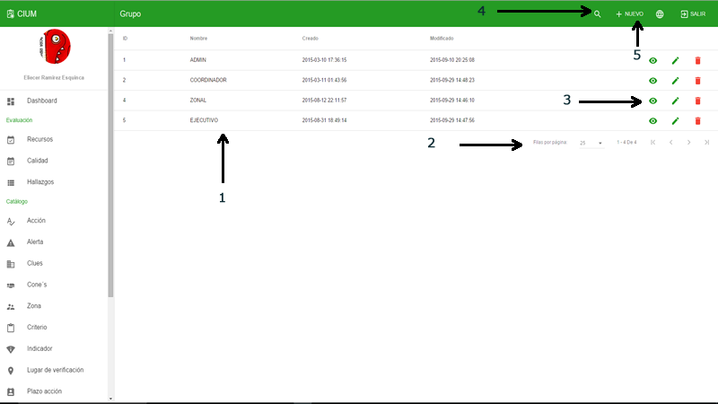
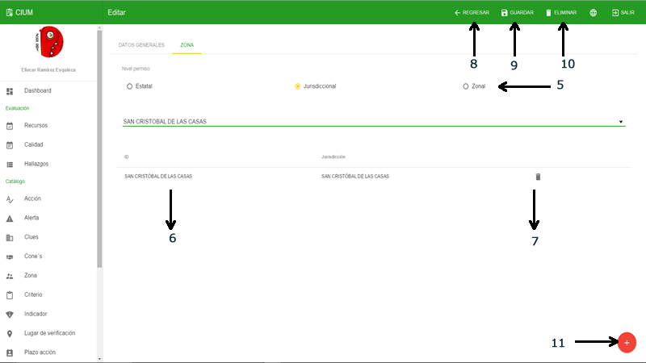

# Sistema

En este apartado esta todo lo relacionado con el usuario, roles y permisos. se pueden configurara permisos por acción lo que hace mas seguro y mas robusto el modelo de permisos.
 
Todos los modulos tiene un listado con las opciones como se describen. 
 

<<<<<<< HEAD:assets/manual usuario/Contents/sistema.md

=======

>>>>>>> 9ab32af076574cb68e180b584a3038b6b9f3e0f6:assets/cium/Contents/sistema.md

>**Listado**

> - 1.- Datos
> - 2.- Paginación y limites por página
> - 3.- Opciones por registro de izquierda a derecha: ver, modificar y eliminar
> - 4.- Despegar el campo de busqueda
> - 5.- Agregar un registro nuevo

<<<<<<< HEAD:assets/manual usuario/Contents/sistema.md

=======

>>>>>>> 9ab32af076574cb68e180b584a3038b6b9f3e0f6:assets/cium/Contents/sistema.md

>**Listado buscar**

> - 6.- Regresar y restablecer las opciones
> - 7.- Campo de busqueda: escribir y dar enter para iniciar la busqueda

## Grupo

Grupo creacion y administracion de los gurpos y configuracion de las acceso a modulos por accion. 

<<<<<<< HEAD:assets/manual usuario/Contents/sistema.md

=======

>>>>>>> 9ab32af076574cb68e180b584a3038b6b9f3e0f6:assets/cium/Contents/sistema.md

>**Crear / Editar**

> - 1.- Nombre del grupo
> - 2.- Módulos
> - 3.- Acciones en el módulo
> - 4.- Regresar al listado
> - 5.- Guardar 
> - 6.- Eliminar
> - 7.- Ir a crear un registro nuevo

## Modulo

Modulo administra los modulos y controladores de laravel para crear las acciones por modulo, se usa para generar los permisos por grupo. 

<<<<<<< HEAD:assets/manual usuario/Contents/sistema.md

=======

>>>>>>> 9ab32af076574cb68e180b584a3038b6b9f3e0f6:assets/cium/Contents/sistema.md

>**Crear / Editar**

> - 1.- Nombre del modulo
> - 2.- Categoria a la que pertenece, si es que pertenece
> - 3.- Nombre en el controlador laravel para proteger el acceso con ese nombre
> - 4.- Si el modulo tiene una vista para administrar
> - 5.- Metodos o acciones accesibles en el módulo. Nombre común
> - 6.- Recurso como se encuentra en el controlador laravel 
> - 7.- Metodo para la peticion HTTP 
> - 8.- Eliminar la fila de la lista
> - 9.- Agregar una linea a la lista
> - 10.- Regresar al listado
> - 11.- Guardar 
> - 12.- Eliminar
> - 13.- Ir a crear un registro nuevo

## Usuario

Usuario administra los usuarios que provienen de SALUD-ID (OAUTH2.0) para que puedan tener acceso al sistema. 

<<<<<<< HEAD:assets/manual usuario/Contents/sistema.md

=======

>>>>>>> 9ab32af076574cb68e180b584a3038b6b9f3e0f6:assets/cium/Contents/sistema.md

>**Crear / Editar**

> - 1.- Correo del usuario, este es el correo con el que se dio de alta en SALUD-ID
> - 2.- Rol o grupo de usuario. Puede ser uno o más 
> - 3.- Denegar permisos al usuario 
> - 4.- Desmarcar las casillas marcadas
> - 5.- Apartado zona. Nivel de permiso: Estatal( todas las unidades médicas del estado), Jurisdiccional (todas las unidades médicas de la jurisdiccion), Zonal (todas las unidades médicas de la zona)
> - 6.- Detalle del nivel de permiso ya sea por jurisdiccion o por clues 
> - 7.- Eliminar la fila  
> - 8.- Regresar al listado
> - 9.- Guardar 
> - 10.- Eliminar
> - 11.- Ir a crear un registro nuevo